# Grama Vasathi 

Grama Vasathi is an Android application built using Kotlin and Jetpack Compose that focuses on rural tourism and farm stay experiences.

## 💡 Problem Statement

Many rural hosts do not have simple digital platforms to showcase their stays and hospitality experiences. At the same time, travelers often find it difficult to discover authentic rural stays and learn about local traditions and cultural practices.

## 🚀 Solution

Grama Vasathi provides a simple and user-friendly mobile experience where users can explore rural stays, view property details, learn cultural practices, and go through a hospitality booking workflow.

The app also includes a host training module that helps hosts prepare accommodations through step-by-step guidance and readiness tracking.

## ✨ Features

### 🏡 Explore Farm Stays
Browse rural stays through a modern card-based interface displaying property images, pricing, ratings, location details, and accommodation information.

### 📄 Property Details & Booking
View stay information and complete a simplified booking workflow with guest selection and dynamic booking summary updates.

### 🔍 Interactive Filtering
### 🔍 Interactive Filtering
Filter farm stay activities through an interactive selection interface.
### ✅ Booking Confirmation
Interactive booking confirmation flow with success state handling and booking completion feedback.

### 🧑‍🌾 Host Training Module
Step-by-step readiness checklist that guides rural hosts in preparing welcoming accommodations and tracking preparation progress.

### 📊 Interactive Progress Tracking
Host preparation tasks update progress dynamically with interactive completion states and readiness tracking.

### 📚 Cultural Guide
Dedicated section introducing travelers to local traditions, etiquette, dining practices, and respectful interaction with rural communities.

### 🎨 Modern Android UI
Built fully using Jetpack Compose with responsive layouts, reusable composables, and smooth bottom navigation across multiple screens.

### 📱 Responsive Design
UI optimized and tested across different Android screen sizes and emulator configurations.

## 🛠️ Tech Stack

### Core Development
- **Kotlin** – Primary programming language used for Android development
- **Jetpack Compose** – Modern declarative UI toolkit used for building the application interface
- **Material Design 3** – UI components, theming, and modern Android design system
- **Navigation Compose** – Used for screen navigation and app flow management

### Backend & Media
- **Firebase Firestore** – Used for storing and managing farm stay property data
- **Cloudinary** – Used for hosting and loading property images
- **Coil** – Used for loading and displaying remote images in Jetpack Compose

### Development & Testing
- **Android Studio** – Main development environment used for building and testing the application
- **Gradle** – Build automation and dependency management system
- **Android Emulator** – Used for testing responsive layouts across different Android screen sizes and device configurations

## ⚙️ Installation & Setup

Follow these steps to run the project locally on your system.

### 1. Prerequisites

Ensure the following are installed:

- Android Studio
- Android SDK (API Level 34 or higher)
- JDK 17 or higher

### 2. Clone the Repository

Open your terminal and run:

```bash
git clone https://github.com/Dhruv488/GramaVasathi.git
```

### 3. Open the Project

1. Launch Android Studio
2. Select **Open**
3. Navigate to the cloned repository folder
4. Open the project and allow Gradle dependencies to sync

### 4. Firebase Configuration

This project uses **Firebase Firestore** for storing and managing farm stay property data.

The required Firebase configuration file (`google-services.json`) is already included in the project for evaluation purposes.

### 5. Build & Run

1. Start an Android Emulator or connect a physical Android device
2. Click the **Run** button in Android Studio
3. Build and launch the application

## 📸 Screenshots & Visual Evidence

### 🎨 App Branding
The visual identity and startup experience of GramaVasathi.


---

### 👤 User Journey

#### 🏡 Explore Farm Stays
Main explore screen displaying farm stay listings, pricing, ratings, search functionality, and responsive card layouts.

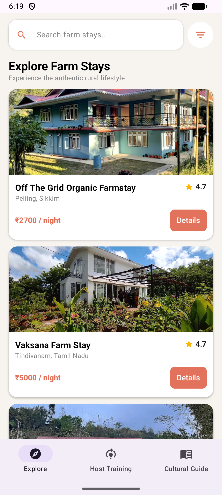

---

#### 🔎 Search Functionality
Real-time search interface for discovering rural stays by property name and location.

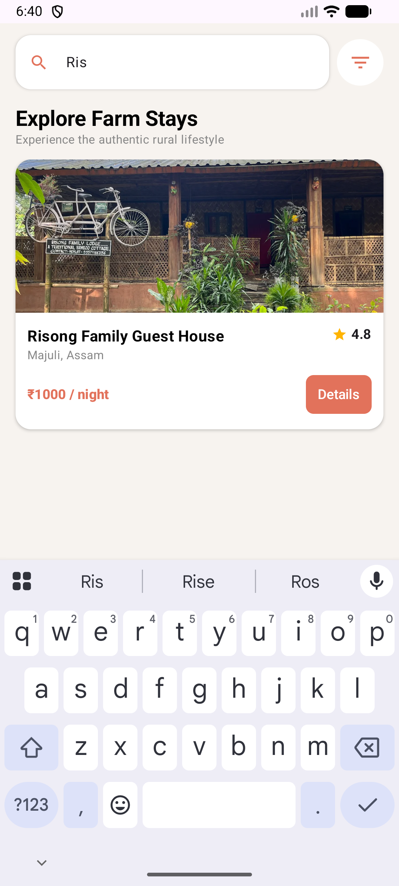

---

#### 🎯 Activity Filter System
Interactive bottom sheet interface for filtering rural stay activities and experiences, including dynamic filtered search results.

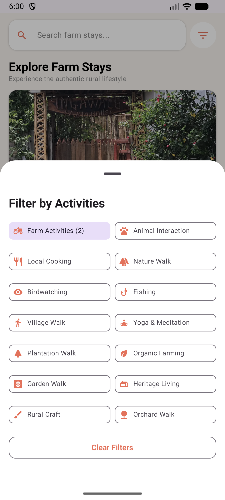 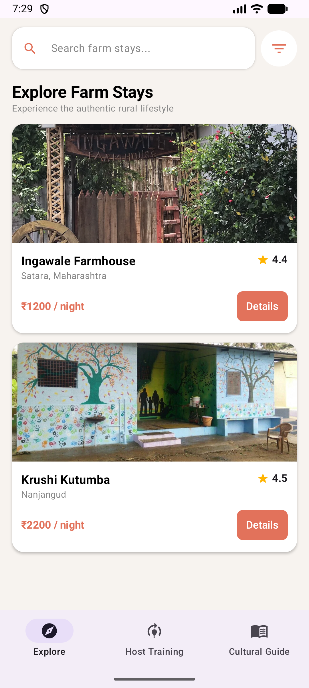

---

#### 🏠 Property Details
Detailed property information including descriptions, gallery images, categorized rural activities with visual activity icons, and host details.

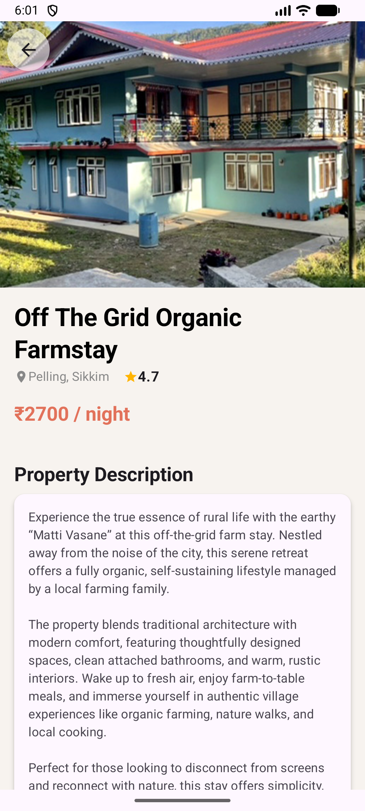 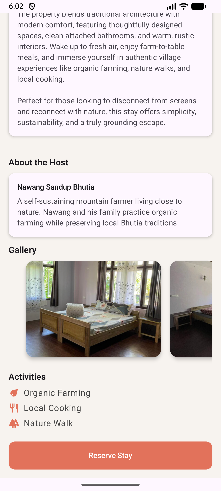

---

#### 📅 Booking Workflow
Reservation interface with guest selection, date handling, and dynamic booking summary updates.

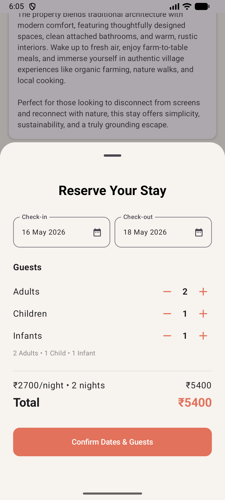 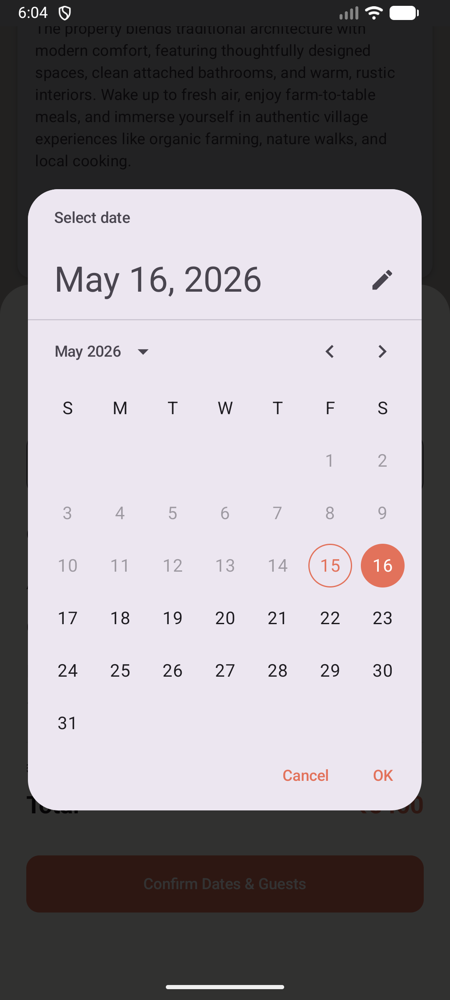

---

#### ✅ Booking Confirmation
Booking success screen displaying reservation confirmation and payment summary.

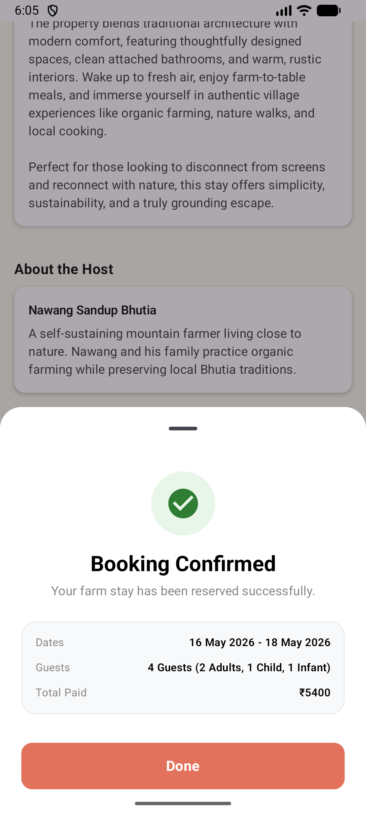

---

### 🧑‍🌾 Host Journey

#### 📋 Host Training & Completion Flow
Step-by-step home readiness workflow for rural hosts with preparation tracking and final hosting readiness status.

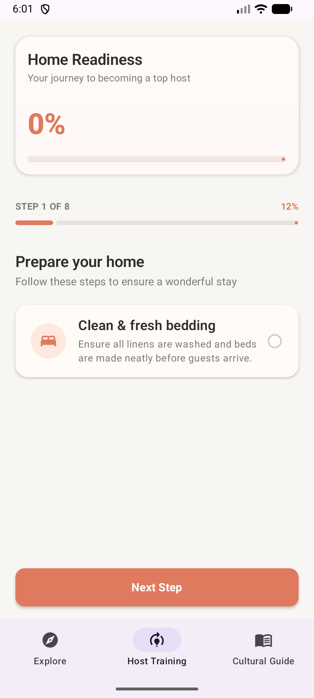 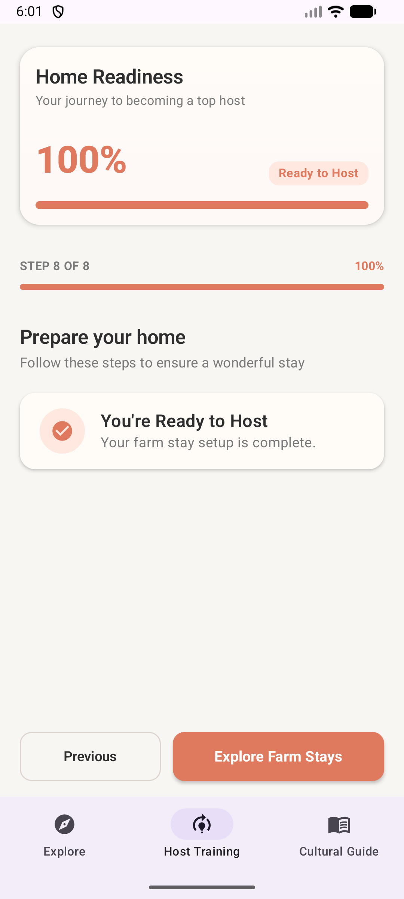

---

### 📚 Cultural Awareness

#### 🌏 Cultural Guide
Educational section introducing travelers to local traditions, etiquette, dining practices, and respectful rural interaction.

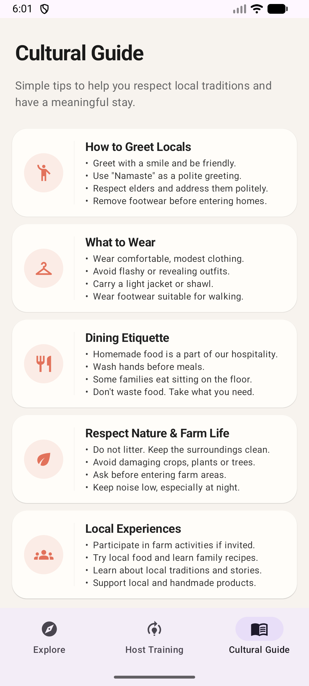

---

### ☁️ Firebase Firestore Backend

#### 🔥 Firestore Database Structure
Firebase Firestore used for storing property information, activities, pricing, image URLs, and rural stay details.

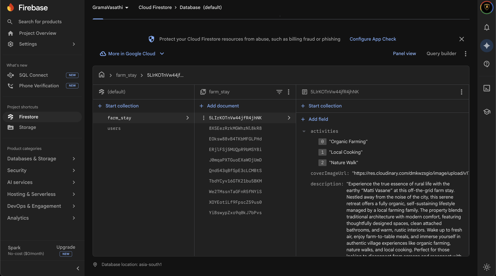

---
## 🎥 Application Demo

A short demonstration video showcasing:
- Explore Screen
- Search & Filtering
- Property Details
- Booking Workflow
- Host Training Module
- Cultural Guide
- Overall application workflow and UI experience

🔗 Demo Video: [Watch Here](https://www.youtube.com/watch?v=nhxdQC2GCmk)

## 🏗️ Project Structure

```plaintext
GramaVasathi/
├── app/
│   ├── src/
│   │   ├── main/
│   │   │   ├── java/com/dhruv/gramavasathi/
│   │   │   │   ├── ui/theme/                # Material 3 custom colors, typography, and themes
│   │   │   │   ├── CulturalGuideScreen.kt  # Cultural awareness and etiquette interface
│   │   │   │   ├── ExploreScreen.kt        # Farm stay discovery and search functionality
│   │   │   │   ├── FarmStay.kt             # Core farm stay data model
│   │   │   │   ├── FarmStayDetailScreen.kt # Property details and booking workflow
│   │   │   │   ├── HostTrainingScreen.kt   # Host readiness and progress tracking
│   │   │   │   └── MainActivity.kt         # Application entry point and navigation
│   │   │   │
│   │   │   ├── res/                        # Drawables, launcher icons, strings, and themes
│   │   │   └── AndroidManifest.xml         # App configuration and permissions
│   │   │
│   │   ├── androidTest/                    # Instrumented testing
│   │   └── test/                           # Unit testing
│   │
│   ├── google-services.json                # Firebase configuration
│   │
│   └── build.gradle.kts                    # App-level Gradle configuration
│
├── gradle/                                 # Gradle wrapper and dependency management
│
├── screenshots/                            # README visual documentation assets
│   ├── splash-screen.png
│   ├── explore.png
│   ├── search-functionality.png
│   ├── filter-system.png
│   ├── farm-activities-results.png
│   ├── property-details-1.png
│   ├── booking-confirmation.png
│   └── ...
│
├── .gitignore                              # Git ignore rules
├── README.md                               # Project documentation
├── build.gradle.kts                        # Project-level Gradle configuration
└── settings.gradle.kts                     # Module configuration
```
## 🚀 Future Improvements

The current version of **Grama-Vasathi** successfully demonstrates rural stay discovery, booking workflows, host onboarding, and cultural awareness features. Future versions of the application can further expand functionality and improve scalability through the following enhancements:

### 🌐 Real-Time Backend Integration
- Implement live Firebase Firestore synchronization for real-time booking updates
- Add Firebase Authentication for secure user and host login systems
- Introduce cloud-based reservation management and booking history

### 💳 Secure Payment Gateway
- Integrate Razorpay or Stripe for secure in-app payments
- Add payment verification and transaction history tracking
- Support partial advance payments and cancellation refunds

### 📍 Maps & Location Services
- Integrate Google Maps API for farm stay navigation
- Add nearby attractions and route recommendations
- Enable location-based property discovery

### ⭐ Ratings & Reviews System
- Allow travelers to submit ratings and written reviews
- Add host feedback and trust indicators
- Introduce verified booking reviews for authenticity

### 🤖 AI-Powered Recommendations
- Recommend farm stays based on user interests and travel preferences
- Suggest activities such as organic farming, trekking, or local cooking
- Personalize search results using behavioral data

### 🌾 Expanded Rural Ecosystem
- Enable local artisans and guides to register services
- Add support for regional events, workshops, and cultural experiences
- Build a marketplace for locally produced rural products

### 📶 Offline Accessibility
- Provide offline caching for property details and cultural guides
- Improve usability in low-network rural regions
- Optimize image loading and mobile performance

### 🌍 Multi-Language Support
- Add support for regional Indian languages
- Improve accessibility for local hosts and travelers
- Enable dynamic language switching inside the application

### 🧑‍🌾 Host Dashboard & Analytics
- Provide hosts with booking insights and readiness statistics
- Track visitor engagement and property performance
- Allow hosts to manage availability and accommodation details

## 🧑‍💻 Author

**Dhruv Naveen**  
Computer Science Student — Dayananda Sagar Academy of Technology and Management (DSATM)

### 🛠️ Project Contribution

- Designed and developed the complete Grama Vasathi Android application
- Built using Kotlin, Jetpack Compose, Firebase Firestore, and Cloudinary
- Implemented real-time search, activity filtering, booking workflows, and host readiness tracking
- Developed responsive UI layouts and reusable Compose components

### 📱 Testing & Validation

- Extensively tested on Redmi 13C to ensure smooth performance and touch responsiveness
- Validated on Pixel 6 and Medium Phone (API 36) emulators for layout consistency
- Verified navigation flow, Firebase data integration, and responsive UI behavior across physical and virtual environments

